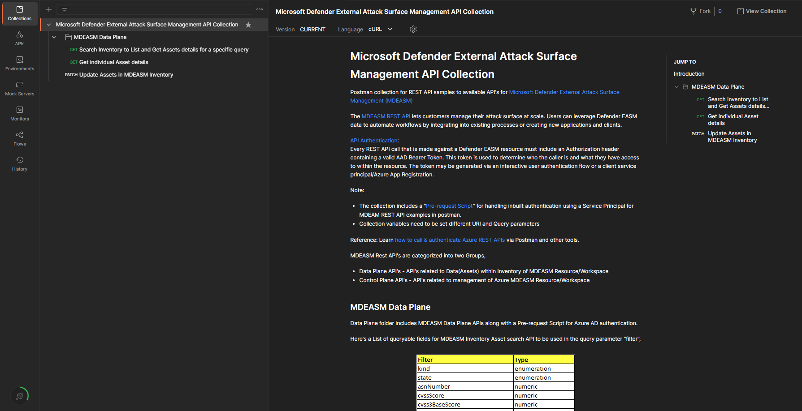

## MDEASM REST API samples using Postman
This repo contains REST API Samples using Postman for Microsoft Defender External Attack Surface Management (MDEASM) API.

## Instructions to use Postman Collection
In order to use the shared postman collection, follow these steps:
1. Install [Postman Client](https://www.postman.com/)
2. Copy the collection [link](https://api.postman.com/collections/24842526-73467100-1039-484c-850b-5550eb0a4ab5?access_key=PMAT-01GKSWRD0CFS3M3SB5WYH2NKA7) and import it as a new Postman collection in your Workspace 
3. Fill in the needed Azure values to the collection variables like SubscriptionID, tenantId etc.   
4. collection is ready to be **Run**
5. Helper file **EASM Filter Mappings.xlsx** for finding queryable field names for Asset Search parameter "filter" can be found in the folder

MDEASM API documentation can be found here, https://learn.microsoft.com/en-us/rest/api/defenderforeasm/

Azure AD Authentication details can be found here, https://docs.microsoft.com/en-us/rest/api/azure/#how-to-call-azure-rest-apis-with-postman

## Suggestions and feedback
We value your feedback. Let us know if you run into any problems or share your suggestions and feedback to MDEASM Go-To-Production (GTP) Customer Experience Engineering (CxE) Team. Email: mdeasm_cxe@microsoft.com
