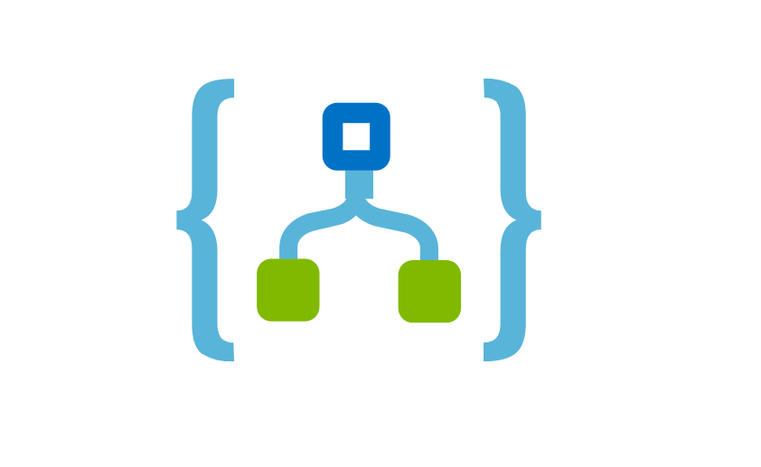

## About
This repo contains sample playbooks for security automation, orchestration and response (SOAR). Each folder contains a Azure Logic App playbook ARM template using Microsoft Defender External Attack Surface Management (MDEASM) API.

## Instructions for deploying a custom template
After selecting a playbook, in the Azure portal:
1. Search for deploy a custom template
2. Click build your own template in the editor
3. Paste the contents from the GitHub playbook 
4. Click **Save**
5. Fill in needed data and click **Review+Create**

Once deployment is complete, you will need to authorize each connection.
1. For Example, Click the Service-now connection resource
2. Click edit API connection
3. Click Authorize
4. Sign in
5. Click Save
6. Repeat steps for other connections

You can now edit the playbook in Azure Logic apps.

MDEASM API documentation can be found here, https://learn.microsoft.com/en-us/rest/api/defenderforeasm/

## Suggestions and feedback
We value your feedback. Let us know if you run into any problems or share your suggestions and feedback to MDEASM Go-To-Production (GTP) Customer Experience Engineering (CxE) Team. Email: mdeasm_cxe@microsoft.com
